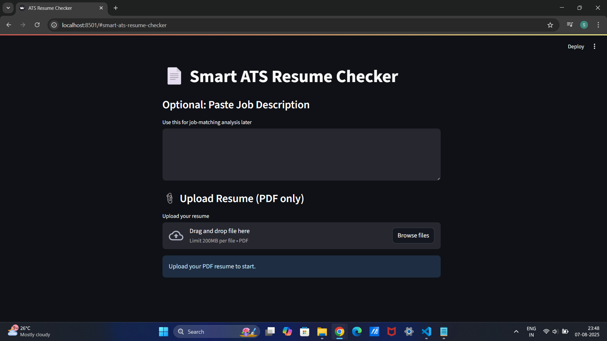
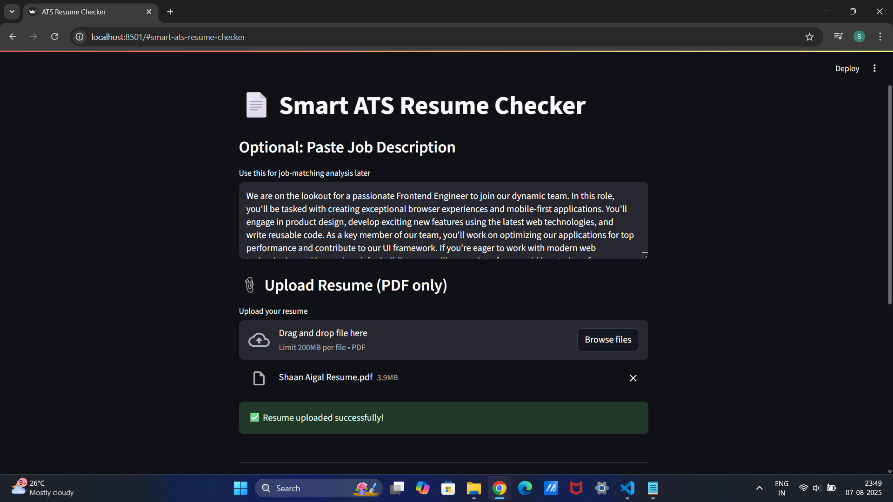
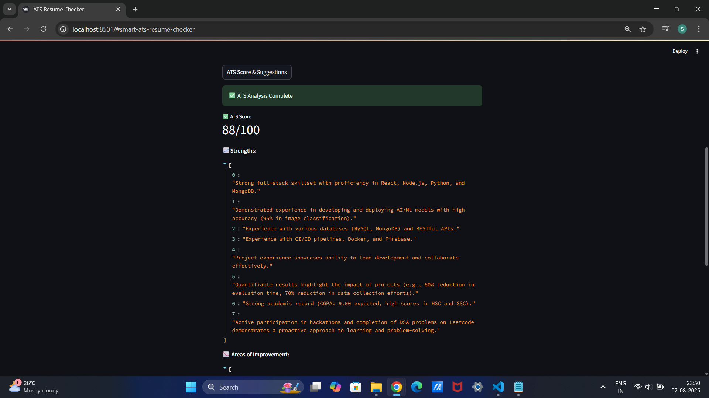
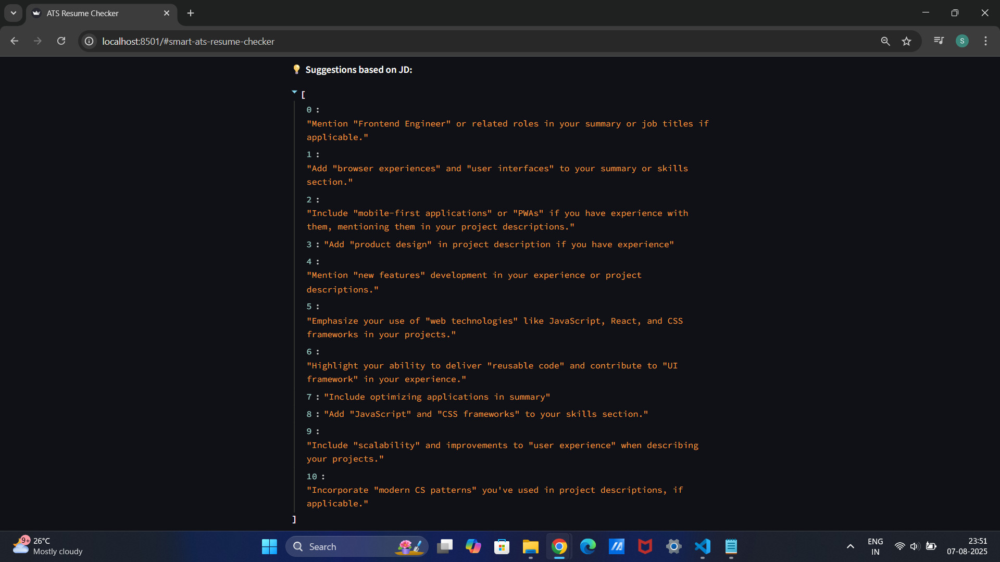
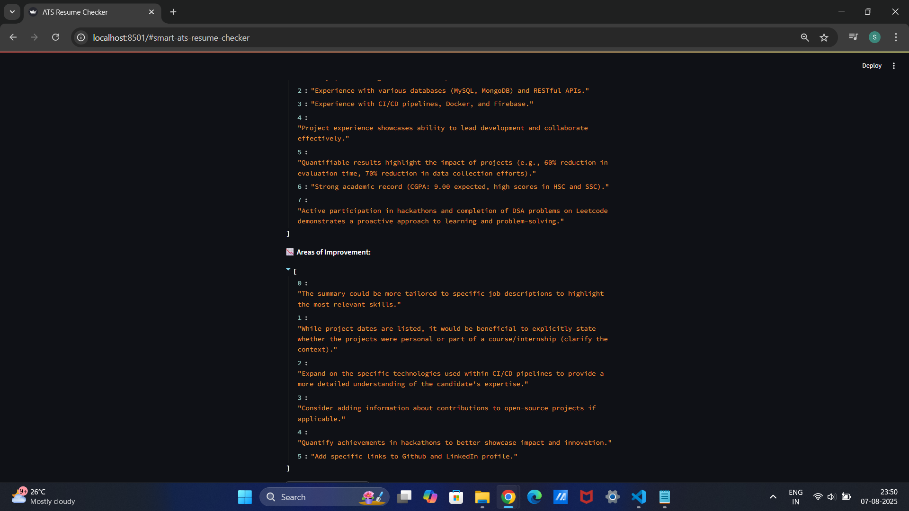
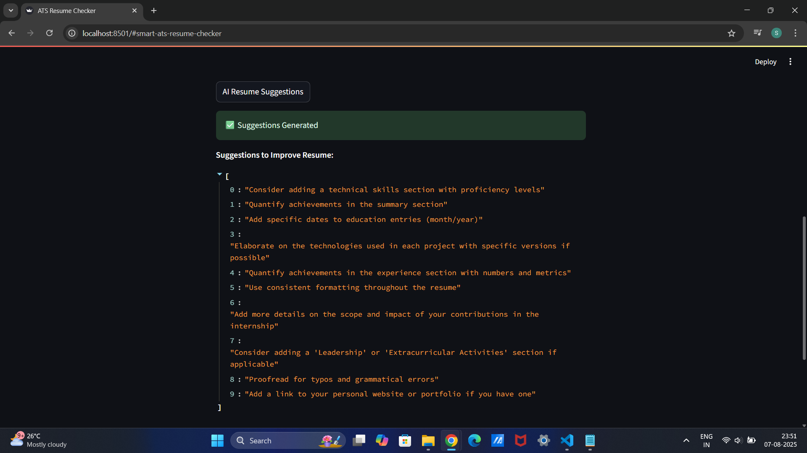
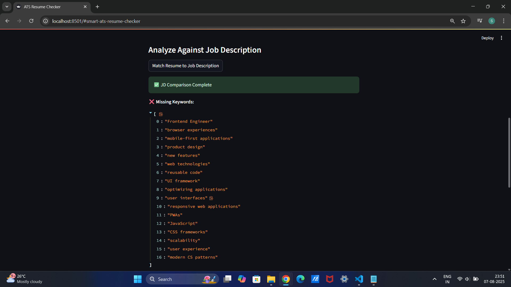

### 1. Upload Resume (PDF)

> User uploads a resume in PDF format using the file uploader.

### 2. ATS Score & Suggestions Button Clicked

> Analyze resume and get ATS Score, strengths, and areas of improvement.

### 3. ATS Analysis Result

> Display of ATS Score with extracted strengths and suggestions for improvement.

### 4. AI Resume Suggestions Button Clicked

> Get general improvement tips for resume formatting and content.

### 5. AI Resume Suggestions Output

> Display of personalized suggestions like adding summary, fixing formatting, etc.

### 6. Job Description Text Area and Match Button

> Optional job description input area and match button for job-resume alignment.

### 7. Resume to JD Matching Result

> Gemini highlights missing keywords and suggests how to align resume with JD.
